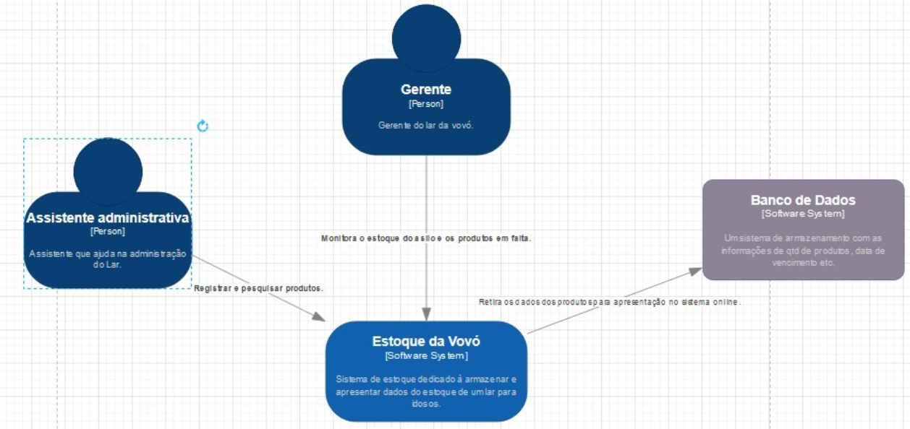
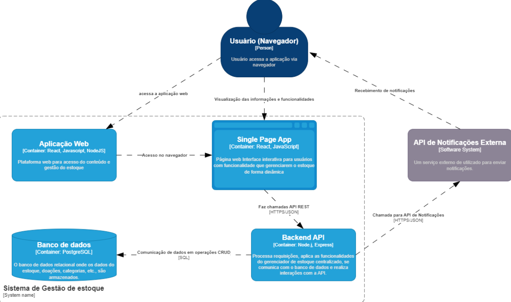
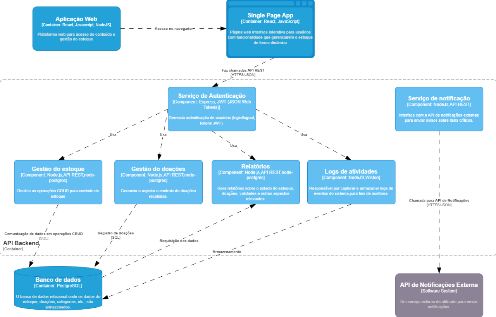
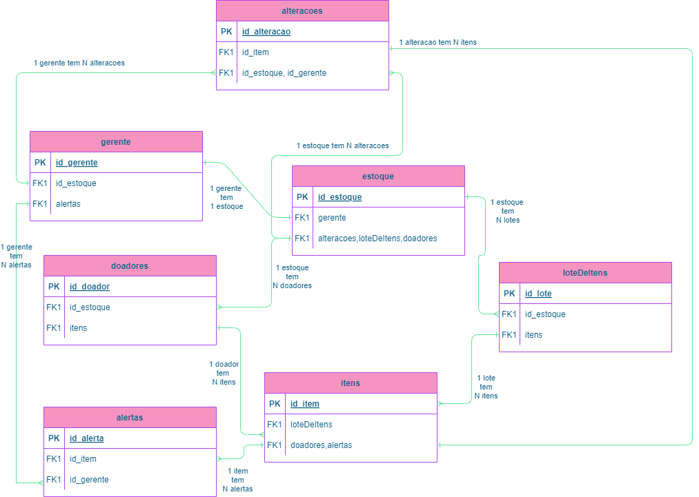

# 3 Modelagem e diagramas arquiteturais: (Modelo C4)

  Iniciando com o usuário interagindo com o Front-end (React e JavaScript), que faz requisições HTTP para uma API RESTful no Back-end (Node.js). O Back-end processa as solicitações, consulta o banco de dados relacional PostgreSQL hospedado no Amazon RDS, e responde ao front-end com os dados solicitados. Para monitoramento, o back-end utiliza o Winston para gerar logs e o Sentry para capturar e monitorar erros. Além disso, o sistema é integrado com Docker, que orquestra os contêineres, e GitHub para a integração e deploy contínuos (CI/CD), que gerenciam o fluxo de desenvolvimento. No diagrama, as setas mostram as conexões entre o front-end, back-end, banco de dados, e as camadas de deploy e orquestração.

## 3.1 Nível 1: Diagrama de Contexto
O diagrama de contexto apresenta a ideia geral do projeto, englobando os usuários, que serão a gerente do Lar e a assistente administrativa, sendo estas responsáveis por monitorar o estoque, bem como analisar os produtos em falta ou sobrando. O estoque da Vovó é o sistema online que será construído para apresentar, de forma concisa e objetiva, os dados relacionados ao estoque do Lar de Idosos, através de um banco de dados relacional. 

   
  Figura 2: Diagrama de Contexto  (fonte: https://c4model.com/)

## 3.2 Nível 2: Diagrama de Contêiner
O diagrama mostra como o sistema de gestão de estoque funciona. O Usuário acessa a Aplicação Web no navegador, que carrega a SPA (Single Page Application) para gerenciar o estoque. A SPA faz chamadas para a Backend API, que lida com as funcionalidades principais e acessa o Banco de Dados para armazenar e recuperar informações. A API de Notificações Externa envia alertas aos usuários, como avisos de validade de produtos. Tudo funciona de forma integrada para garantir a eficiência do controle de estoque. 

   
  Figura 3 – Diagrama de Contêiner  (fonte: https://c4model.com/)

## 3.3 Nível 3: Diagrama de Componentes
Estre diagrama representa o nível interno do container Backend API, com demonstração de suas funcionalidades e tecnologias, Temos uma composição por vários serviços que trabalham juntos para gerenciar o sistema de estoque: o Serviço de autenticação cuida da autenticação dos usuários que e feita antes realizar qualquer outra funcionalidade; A Gestão do estoque realiza operações de controle de estoque e armazenamento de dados; o Serviço de notificação envia alertas sobre itens próximos da validade, o Gestão de doações registra as doações recebidas e armazena no banco de dados; e, por fim, o componente de Logs registra eventos do sistema para auditoria. Juntos, esses componentes garantem a eficiência e a segurança do gerenciamento de estoque. 

   
  Figura 4 – Diagrama de Componentes  (fonte: https://c4model.com/)

## 3.4 Nível 4: Código

No centro do diagrama Entidade-Relacionamento, temos "Gerente", que é o responsável por monitorar o estoque e gerenciar os avisos relacionados aos itens armazenados. Esse gerente tem um relacionamento direto com a entidade Estoque, onde estão registrados todos os itens disponíveis. O estoque contém informações detalhadas sobre os produtos, como suas quantidades e local de armazenamento. 

"Lotes de itens" se relaciona com "Estoque" e "Itens" para detalhar cada produto específico. Essa relação também permite que o sistema identifique os produtos próximos do vencimento. Quando o gestor ou o sistema detecta um problema no estoque, como itens em baixa quantidade ou produtos perto do vencimento, é gerado um Alerta. Esses alertas são essenciais para que o gestor possa agir de forma proativa na reposição ou utilização adequada dos recursos. 

"Doadores" representam as pessoas ou organizações que contribuem com itens. As doações podem incluir uma variedade de produtos, e o sistema precisa garantir que essas doações sejam devidamente registradas e monitoradas para evitar desperdício ou duplicidade. 

Além disso, há o registro de "Alterações" no estoque, permitindo o controle preciso de quais itens foram adicionados ou retirados, garantindo um histórico detalhado de todas as movimentações. 

    
  Figura 5 – Diagrama de Entidade Relacionamento (ER)

